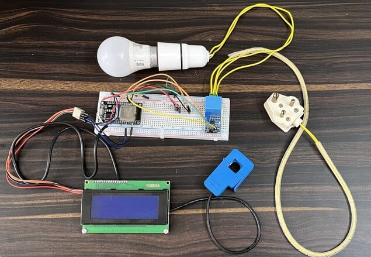
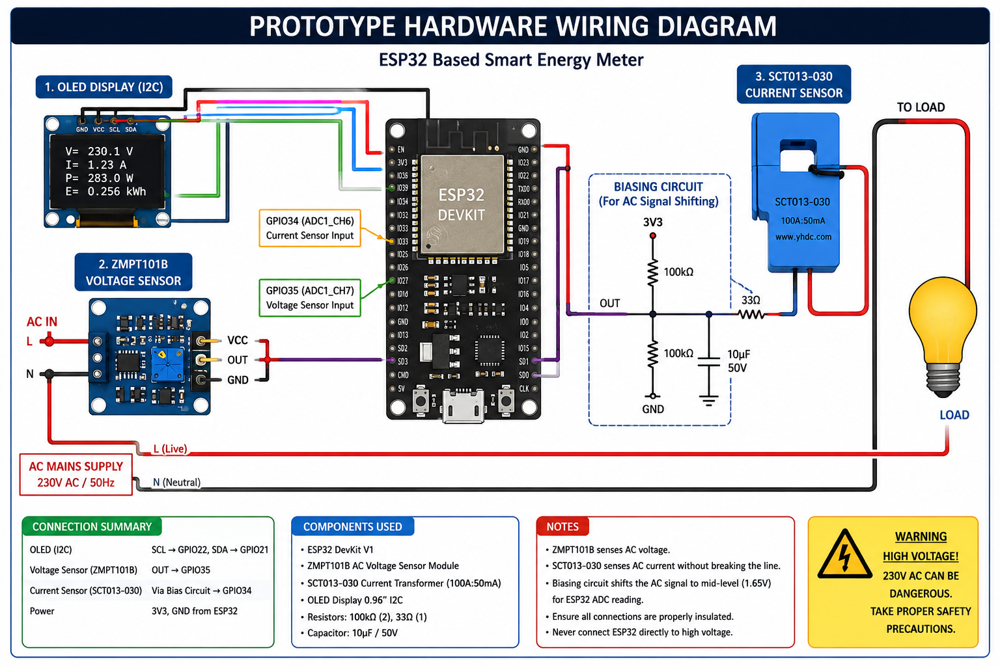
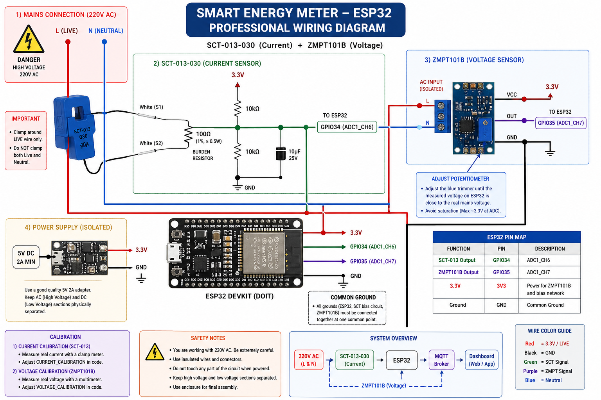
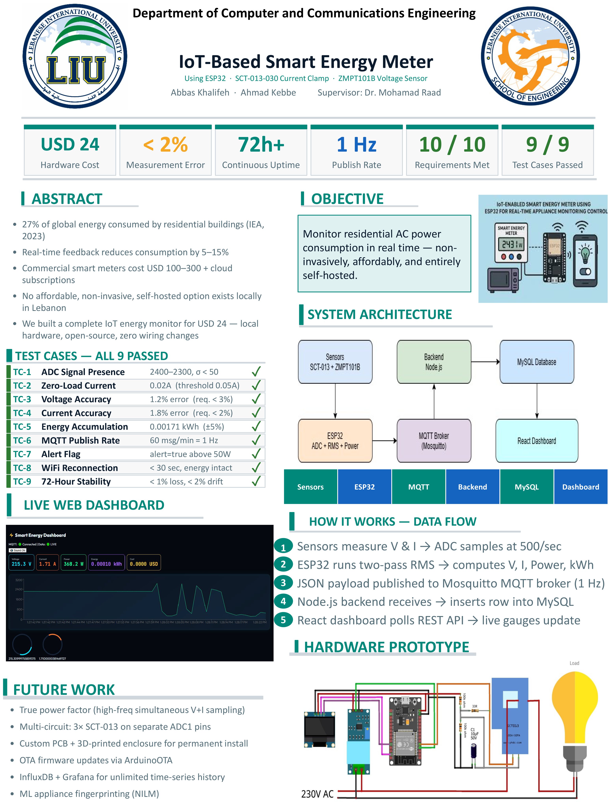

# ⚡ Smart Energy Meter System

A complete IoT-based smart energy monitoring system using ESP32, MQTT, Node.js, MySQL, and React.js.

---

# 📌 Project Overview

This project was developed as a senior Computer & Communication Engineering graduation project.

The system measures and monitors:

- Voltage
- Current
- Power Consumption
- Energy Usage
- Electricity Cost

in real time using:
- ESP32 microcontroller
- SCT-013 current sensor
- ZMPT101B voltage sensor

The system transmits live data using MQTT and visualizes it through a modern React dashboard.

---

# 🏗 System Architecture

ESP32 Sensors  
→ MQTT Broker  
→ Node.js Backend  
→ MySQL Database  
→ React Dashboard

---

# 📂 Project Repositories

## Frontend Dashboard

🔗 [Frontend Repository](https://github.com/abbas2002khalifeh-prog/smart_energy_frontend)

---

## Backend API

🔗 [Backend Repository](https://github.com/abbas2002khalifeh-prog/smart_energy_backend)

---

# 📸 Project Screenshots

## Dashboard

---

## Hardware Prototype

---

## Wiring Diagram

---

## System Architecture

---

## Final Poster

---

# 🚀 Features

- Real-time monitoring
- MQTT communication
- Live dashboard
- Energy consumption tracking
- Cost estimation
- Overload alerts
- Database storage
- Responsive UI
- LCD display support

---

# 🛠 Technologies Used

## Hardware
- ESP32
- SCT-013 Current Sensor
- ZMPT101B Voltage Sensor
- LCD1602 I2C Display

## Software
- React.js
- Node.js
- Express.js
- MySQL
- MQTT
- Mosquitto
- Arduino IDE

---

# 📊 Dashboard Metrics

- Voltage (V)
- Current (A)
- Power (W)
- Energy (kWh)
- Cost ($)

---

# 👨‍💻 Author

Abbas Khalifeh

Computer & Communication Engineering  
Lebanese International University

---

# 📄 License

This project is intended for educational and research purposes.